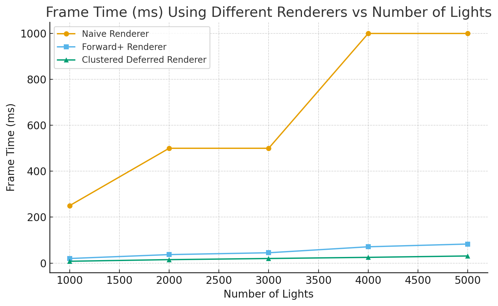
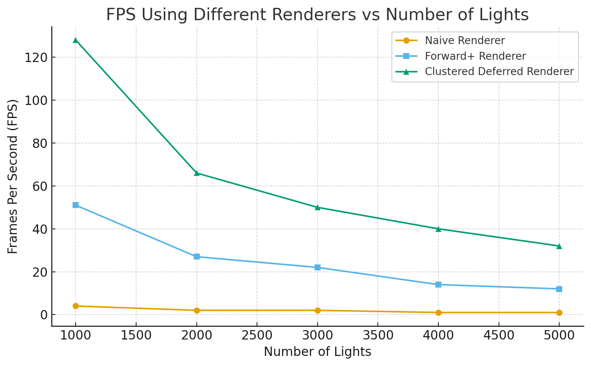

WebGL Forward+ and Clustered Deferred Shading
======================

**University of Pennsylvania, CIS 565: GPU Programming and Architecture, Project 4**

* Sirui Zhu
* Tested on: **Google Chrome 141.0.7390.78** on
  Windows 11, i7-13620H, RTX 4060 (Personal)

### Live Demo

[Live Demo Link](http://angelasiruizhu.github.io/Project4-WebGPU-Forward-Plus-and-Clustered-Deferred)

### Screenshot

### Demo

## Project Overview

This project implements three different rendering techniques in WebGPU:
1. Naive Forward Rendering
2. Forward+ Rendering
3. Clustered Deferred Rendering

### Implementation Details

#### 1. Naive Forward Rendering
The naive implementation processes each fragment by considering all lights in the scene:
- Single render pass pipeline using vertex and fragment shaders
- Fragment shader iterates through all lights for each pixel
- Simple but inefficient with many lights
- Performance scales linearly with light count (O(pixels * lights))

#### 2. Forward+ Rendering
Forward+ rendering represents a significant advancement through light culling optimization:

Implementation Flow:
- Compute shader partitions screen into fixed-size tiles
- Light culling phase runs before main rendering:
  - Analyzes each light's potential influence
  - Assigns lights to relevant screen-space tiles
  - Stores results in per-tile light lists
- Main render pass:
  - Accesses pre-computed light assignments
  - Processes only lights affecting the current tile
  - Performs lighting calculations with reduced set

#### 3. Clustered Deferred Rendering
Combining deferred rendering with light clustering:

G-Buffer Pass:
- Renders scene information to multiple render targets:
  - Position buffer
  - Normal buffer
  - Albedo buffer 
- No lighting calculations in this pass

Light Clustering:
- Similar to Forward+ but works in view space
- Creates 3D grid of clusters
- Assigns lights to clusters based on overlap

Final Lighting Pass:
- Fullscreen pass that reads G-buffer textures
- Uses clustered light information
- Computes final lighting using only relevant lights

### Performance Analysis

#### Frame-time Comparison Across Different Rendering Methods

#### FPS Comparison Across Different Rendering Methods

1. Naive Forward Rendering

The naive renderer spends nearly all of its frame time inside the fragment shader because each pixel iterates the entire light list. This implementation detail directly explains the steep rise in frame time — roughly 250 ms at 1,000 lights and up to ~1,000 ms at 4,000–5,000 lights — because the shader work is proportional to pixels × lights. No pre-filtering or spatial culling is performed, so every additional light multiplies shading cost and quickly pushes the frame time much higher.

2. Forward+

Forward+ reduces fragment cost by performing a compute-pass light culling step that assigns lights to fixed-size screen tiles and writes per-tile lists to a storage buffer. The fragment shader then reads only the lights in its tile. These implementation choices are why measured frame times are much lower than naive (about 20 ms at 1,000 lights and 83 ms at 5,000 lights) — the work done in the fragment stage is bounded by lights-per-tile instead of total scene lights. The trade-off is extra compute and memory traffic during the culling pass. This trade-off can be mitigated by using adaptive tile sizing—allocating smaller tiles in dense light regions and larger ones in sparse areas—to balance compute workload and memory traffic while preserving the benefits of localized light evaluation.

3. Clustered Deferred

Clustered Deferred separates geometry and lighting (G-buffer) and assigns lights into a 3D view-space cluster grid. The final fullscreen lighting pass reads G-buffer textures and evaluates only cluster-local lights. Because costly shading is removed from the geometry pass and lighting work is limited by cluster occupancy, frame times are the lowest in these measurements (~8 ms at 1,000 lights, ~31 ms at 5,000 lights). The implementation uses a fullscreen pass to avoid redundant shading and a storage buffer to hold cluster light lists; these choices minimize per-pixel work and explain the headroom seen in the numbers. The trade-off is that it cannot achieve transparency alone, and has to work with forward methods. 

### Credits

- [Vite](https://vitejs.dev/)
- [loaders.gl](https://loaders.gl/)
- [dat.GUI](https://github.com/dataarts/dat.gui)
- [stats.js](https://github.com/mrdoob/stats.js)
- [wgpu-matrix](https://github.com/greggman/wgpu-matrix)
